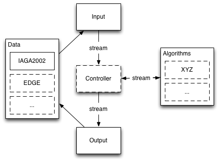

Geomag Algorithms API
=====================

Geomag algorithms is built around the
[ObsPy](https://github.com/obspy/obspy/wiki),
[SciPy](http://www.scipy.org/),
and [NumPy](http://www.numpy.org/)
frameworks, which provide many tools for processing timeseries and other
scientific data.


## Architecture

- Data are read into a standard Internal Data Format by Input/Output factories.
- Algorithms process data.
- A command line script `geomag.py` uses a Controller to manage input,
optional processing, and output of data.




## Internal Data Format

ObsPy Trace and Stream objects are used to hold timeseries data.

- [Custom geomag metadata properties](./metadata.md) are added to each Trace
object's Stats by IO factories.
- Data gaps are represented as `numpy.nan`.
- Times use `obspy.core.UTCDateTime`.
- Most channels use `nT` units.
- Angular channels use `radians`.


## Input/Output factories

Base class is `geomagio.TimeseriesFactory`.
Exception base class is `geomagio.TimeseriesFactoryException`.

- [Edge/Earthworm](./io/Edge.md) `geomagio.edge.EdgeFactory`
- [IAGA 2002](./io/Iaga2002.md) `geomagio.iaga2002.IAGA2002Factory`
- IMF V2.83 (Input Only) `geomagio.imfv283.IMFV283Factory`
- PCDCP `geomagio.pcdcp.PCDCPFactory`


## Algorithms

Base class is `geomagio.algorithm.Algorithm`
Exception base class is `geomagio.algorithm.AlgorithmException`

- Adjusted `geomagio.algorithm.AdjustedAlgorithm`
- Delta F `geomagio.algorithm.DeltaFAlgorithm`
- XYZ `geomagio.algorithm.XYZAlgorithm`


## Example

The following example:
- Uses `EdgeFactory` to read data from the USGS EDGE server
- Uses `XYZAlgorithm` to change the data from observatory channels (H, E, Z, F)
  to geographic channels (X, Y, Z, F).
- Plots the data using matplotlib

```python
from geomagio.algorithm import XYZAlgorithm
from geomagio.edge import EdgeFactory
from obspy.core import UTCDateTime

# read data from the USGS EDGE server
factory = EdgeFactory(host='cwbpub.cr.usgs.gov', port=2060)
hezf = factory.get_timeseries(
        observatory='BOU',
        interval='minute',
        type='variation',
        channels=('H', 'E', 'Z', 'F'),
        starttime=UTCDateTime('2015-11-01T00:00:00Z'),
        endtime=UTCDateTime('2015-11-01T23:59:59Z'))

# convert from HEZF channels to XYZF channels
algorithm = XYZAlgorithm(informat='obs', outformat='geo')
xyzf = algorithm.process(hezf)

# open interactive matplotlib plot
xyzf.plot()
```
